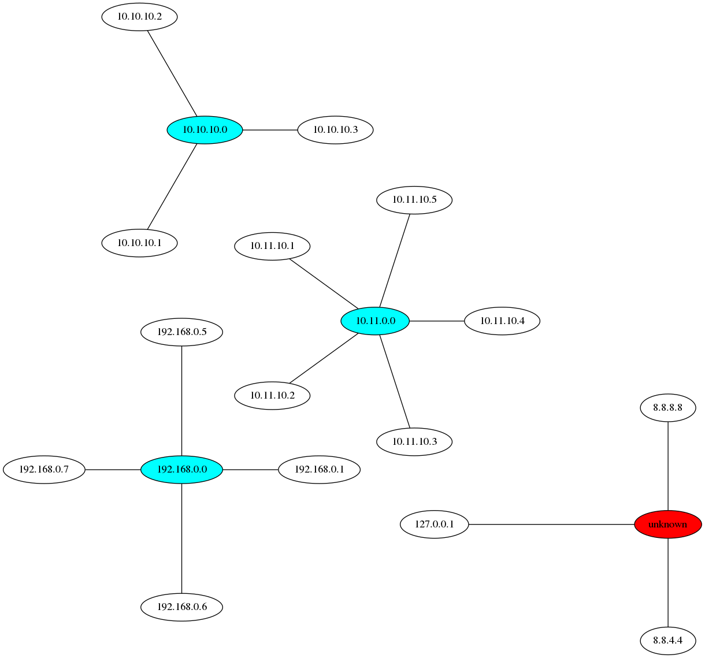

## Hosts file to network topology

Run the script.
```bash
./hosts2topology
```
And it generates a PNG based on the hosts file in the same directory. The CIDR
info is extracted from the comments.
```bash
# Network hint
# 192.168.0.0/27

# Normal hosts
# Only the IP is used
192.168.0.1 neque
192.168.0.5 maxime
192.168.0.6 ea
```



### TODO
- [ ] add CIDR format to graph

